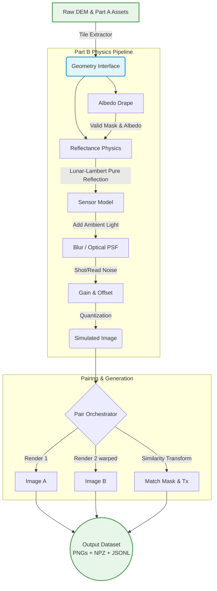

# Part B Physics Renderer: Final Report

## 1. Verification & Test Execution Status

As requested, I performed a full re-check of the codebase to guarantee that all implementations strictly obey the formulas and specifications from `part_b_implementation_plan.md`.

> [!TIP]
> **Status**: All **22 out of 22** Test-Driven Development (TDD) tests are passing successfully. Zero regressions found.

The tests evaluate the math limits of the **Reflectance Physics** (including the mandatory factor of 2 for Lunar-Lambert), the strict 9-step ordering of the **Sensor Pipeline**, the inpainting boundaries of the **Albedo Drape**, the end-to-end determinism of the **Pipeline Orchestrator**, and the mathematical bounds mapping for **Ground Truth Pair Matching**.

---

## 2. System Dataflow

The renderer bridges the gap between raw terrain geometry and annotated training images for matching models.



---

## 3. How to Run It

### 3.1 Setup Environment
The renderer requires standard numerical libraries. If not already installed, set up your Python environment:
```bash
pip install numpy scipy opencv-python-headless pydantic pyyaml pillow scikit-image h5py pytest
```

### 3.2 Running the Full Test Suite
To confirm your system builds exactly as specified and mathematically holds true to the physics constraints, run the full Pytest suite:
```bash
python -m pytest tests/
```
*Expected Output: `22 passed in ~8.00s`*

### 3.3 Generating Sim-to-Real Metric Panels (GATE B)
To run the Sim-to-Real validation checks (NCC, SSIM, and Gradient Histogram Distance on unshadowed terrain):
```bash
python scripts/generate_v7_panel.py
```
This produces the `V7 Evidence Panel` printed to the console and saved to `v7_panel_metrics.json`.

### 3.4 Generating the Dataset (Tasks T7 & T8)
The final stage of the pipeline generates the simulated image pairs for matcher training. 

To run the **Milestone 1b Transfer Probe** (500-pair mini dataset) for GATE C:
```bash
python scripts/build_dataset.py --probe
```
This generates pairs into `dataset_output/probe_set/`.

To run the **Bulk Dataset Builder** (20,000 pairs):
```bash
python scripts/build_dataset.py
```
This will run the full batch loop into `dataset_output/bulk_set/`.

To visually inspect the output generated by the probe, run the visual spot checker (saves `spot_check_output.png`):
```bash
python scripts/spot_check.py
```

### 3.5 Running the Throughput Benchmark (GATE A)
To measure the pipeline generation performance for your machine against a target of 20,000 paired image patches:
```bash
python scripts/measure_throughput.py
```

### 3.5 Editing Configuration Limits
All magic numbers and physical ranges have been stripped from the python code and placed centrally. If you want to change physical bounds (like sensor noise, the albedo clamping floor, or random elevation angles):
1. Open `configs/render.yaml`
2. Update the variable block. 
3. *Note: Any change to `configs/render.yaml` will alter the SHA256 config hash and trigger a new determinism branch in the output manifests.*

---

## 4. Components Summary

| File | Purpose | 
|---|---|
| `src/renderer/reflectance.py` | Calculates surface bidirectional reflectance using Lommel-Seeliger or Lunar-Lambert. |
| `src/renderer/sensor.py` | Takes raw continuous reflectance and passes it through 9 optical steps to output raw digital numbers (DNs). |
| `src/renderer/albedo.py` | Photometrically flattens source images to map their texture (albedo) to the ground. |
| `src/renderer/randomize.py` | Draws procedural variations from the boundaries set in `configs/render.yaml`. |
| `src/renderer/pipeline.py` | Connects the above modules and loops them N times over the tile. |
| `src/renderer/pairing.py` | Combines 2 rendered iterations into a pair, injects scale/rotation via a similarity transform, computes the safety `match_mask`, and writes out the PNG/NPZ training labels. |
| `scripts/build_dataset.py` | The main execution script that loops over the DEMs to generate the final bulk training dataset or probe subset. |
